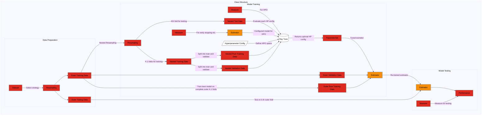

# STPP Glue Code

This repository provides a **glue code** framework for experimenting with Spatiotemporal Point Process (STPP) methods, at the momemnt only two frameworks are included: **NeuralSTPP** and **DeepSTPP** (with deepstpp not tested yet). It centralizes data loading, configuration, and training/evaluation scripts so you can easily switch or combine these methods.

## Contents

- **configs/**: YAML configuration files (Hydra/OmegaConf) for specifying hyperparameters, data paths, logging settings, etc.
- **data/**, **data_generators/**, **data_loader/**: Scripts for data preprocessing, normalization, and loader utilities (YA: This will be updated entirely to have an abstraction of its own, it will have different DGPs and different pattern complexity assessments)
- **lib/**: Contains cloned repositories or integrated code for (YA: These where cloned cloned):
  - **neural_stpp/** (Facebook Research’s NeuralSTPP).
  - **deepstpp/** (Rose-STL-Lab’s DeepSTPP).
  - **my_utils/**: Utility modules (e.g., logging wrappers, config helpers).
- **runner/**: Runners (e.g., `NeuralSTPPRunner`, `DeepSTPPRunner`) to orchestrate training pipelines (YA: in the next version, this will be only one file -if possible-)
- **scripts/**: Additional scripts for tasks like model conversion, debugging, or dataset visualization.
- **stpp_models/**: Adapters/wrappers that unify the different STPP approaches under a common interface (e.g., `NeuralSTPPAdapter`, `DeepSTPPAdapter`).
- **mlruns/**, **outputs/**: Byproducts of experiment tracking (MLflow) and Hydra’s output directories.
- **train.py**: Entry point for running training/evaluation with Hydra.

## Run

```bash
python train.py -m hydra/launcher=joblib model=jumpcnf,selfattn,jumpgmm
```

## Comments

1. **run the following when using NeuralSTPP**

   ```
   python setup.py build_ext --inplace
   ```

   (YA: I will think of a better way of doing this)

2. **Install Dependencies:**

   ```bash
   pip install -r requirements.txt
   ```

## Framework and roadmap

Below is the framework we are building for this package.
Rectangular nodes represent base classes with the colours indicating implementation progress:

- Green = Complete
- Orange = In Progress
- Red = To Do


