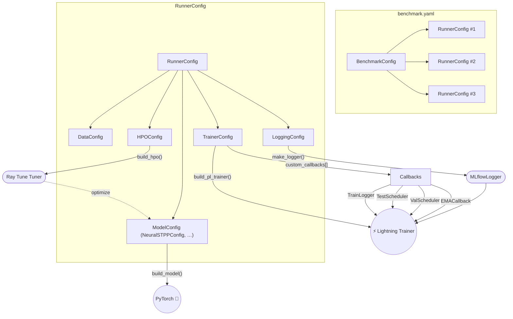
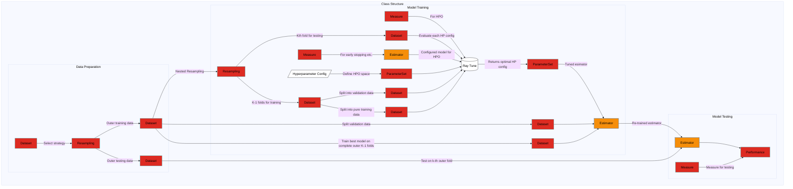

<p align="center">
  
  <h1 align="center">BenchSTPP</h1>
  <p align="center">
    <strong>A flexible benchmarking toolkit for streaming Spatio-Temporal Point Process models</strong>
  </p>

  <!-- Badges -->
  <p align="center">
    <a href="https://pypi.org/project/gluecode/"></a>
      <a href="https://github.com/YahyaAalaila/STPPGC/commits/main">
    
    <a href="https://img.shields.io/github/actions/workflow/status/YourOrg/GlueCode/ci.yml"></a>
     <a href="https://github.com/YahyaAalaila/STPPGC/issues">
    
  </a>
    <a href="https://img.shields.io/badge/license-Apache%202.0-blue.svg"></a>
  </p>
</p>

---
<p align="center">
  <!-- Python version -->
  <a href="https://www.python.org/doc/versions/">
    
  </a>
  <!-- PyTorch -->
  <a href="https://pytorch.org/">
    
  </a>
  <!-- PyTorch Lightning -->
  <a href="https://www.pytorchlightning.ai/">
    
  </a>
  <!-- Ray Tune -->
  <a href="https://docs.ray.io/en/latest/tune/index.html">
    
  </a>
</p>

## Table of Contents

| [News](#news) | [Features](#features) | [Installation](#installation) | [Quick Start](#quick-start) | [Usage](#usage) | [Configuration](#configuration) | [Benchmark](#benchmark) | [Contributing](#contributing) | [License](#license) |

---


## 🗞️ News

-   Presentation at LGHT

## Features [Back to Top](#benchstpp)

- **Configurable & Extensible**  
  Abstract configs for data, model, trainer, logging & HPO—drop in your own STPP modules or configs.

- **Lightning-ready**  
  Built on PyTorch Lightning for seamless multi-GPU, checkpointing and logging support.

- **Ray Tune HPO**  
  Plug-and-play hyperparameter sweeps via Ray Tune—you choose the strategy, we manage the trials.

- **Multi-event-type support (Upcoming)**  
  Plan to benchmark models on streams with multiple event classes in one unified run.

- **Reproducible**  
  Deterministic seeds, versioned configs, MLflow tracking—all your runs can be replayed exactly.


## Model List [Back to Top](#benchstpp)

We provide reference implementations of various state-of-the-art STPP papers:

| No | Publication | Model    | Paper                                                                 | Implementation                                                   |
|----|-------------|----------|-----------------------------------------------------------------------|------------------------------------------------------------------|
| 1  | Arxiv     | SMASH    | [Embedding Event History to Vector](https://arxiv.org/pdf/2310.16310) | [PyTorch](https://github.com/zichongli5/SMASH/tree/main) |
| 2  | ACM  | DSTPP        | [Spatio-temporal Diffusion Point Processes](https://dl.acm.org/doi/10.1145/3580305.3599511)      | [PyTorch](https://github.com/tsinghua-fib-lab/Spatio-temporal-Diffusion-Point-Processes/tree/main) |
| 3  | NeurIPS’19  | NJSDE   | [Neural Jump Stochastic Differential Equations](https://proceedings.neurips.cc/paper_files/paper/2019/file/59b1deff341edb0b76ace57820cef237-Paper.pdf)      | [PyTorch](https://github.com/000Justin000/torchdiffeq/tree/jj585) |
| 4  | ICLR 21     | NeuralSTPP      | [Neural Spatio-Temporal Point Processes](https://arxiv.org/abs/2011.04583)     | [PyTorch](https://github.com/facebookresearch/neural_stpp) |
| 5  | L4DC 22     | DeepSTPP       | [Deep Spatiotemporal Point Process](https://proceedings.mlr.press/v168/zhou22a/zhou22a.pdf)        | [PyTorch](https://github.com/Rose-STL-Lab/DeepSTPP) |
| 6  | ICLR’22     | NMSTPP | [Neural Spectral Marked Point Processes](https://arxiv.org/abs/2106.10773) | [PyTorch](https://github.com/meowoodie/Neural-Spectral-Marked-Point-Processes/tree/main) |
| 7  | NeurIPS’23     | AutoSTPP   | [Automatic Integration for Spatiotemporal Neural Point Processes](https://arxiv.org/abs/2310.06179) | [PyTorch](https://github.com/Rose-STL-Lab/AutoSTPP) |
| 8  | Springer     | NMSTP   | [Transformer-Based Neural Marked Spatio Temporal Point Process Model for Football Match Events Analysis](https://arxiv.org/abs/2302.09276) | [PyTorch](https://github.com/calvinyeungck/Football-Match-Event-Forecast) |


## Overview

**BenchSTPP** is an easy-to-use, highly-configurable framework for

- 🔄 **Benchmarking** streaming Spatio-Temporal Point Process (STPP) models in parallel  
- ⚙️ **Config management** via  [![Hydra][hydra-badge]][hydra]  
- 📊 **Logging & tracking** via [![MLflow][mlflow-badge]][mlflow]  
- 🚀 **Distributed tuning** via [![Ray Tune][raytune-badge]][raytune]

...

[hydra]:     https://hydra.cc/  
[mlflow]:    https://mlflow.org/  
[raytune]:   https://docs.ray.io/en/latest/tune/index.html  

[hydra-badge]:   https://img.shields.io/badge/Hydra-1.3-blue?logo=hydra&logoColor=white  
[mlflow-badge]:  https://img.shields.io/badge/MLflow-1.38-orange?logo=mlflow&logoColor=white  
[raytune-badge]: https://img.shields.io/badge/Ray_Tune-2.9-yellow?logo=ray&logoColor=white  


Designed for researchers and practitioners who want:  
> “**One config → many runs**, fully reproducible, effortlessly parallel.”  

---
## News

- 🆕 **2025-05-18** Added true parallel benchmarking with `ProcessPoolExecutor` and improved error handling.  
- 🆕 **2025-05-10** Fixed MLflow URI parsing bug (`file:./mlruns` now works!).  
- 🆕 **2025-04-30** Switched default config schema to Hydra v1.3.  

*(Click the “+” below to see past releases…)*

<details>
<summary>Previous news</summary>

- **2025-03-12** Initial public release: Hydra + MLflow + Optuna + multi-process runner  
- **2025-02-25** Added `RunnerState` checkpointing & resume  
</details>
---

## Installation

```bash
# From PyPI
pip install gluecode

# Or from source
git clone https://github.com/YourOrg/GlueCode.git
cd GlueCode
pip install -e .
```


## Getting Started

Kick the tires with our **Example Usage** Colab:

<p align="left">
  <a href="https://colab.research.google.com/github/your-user/your-repo/blob/main/notebooks/example_usage.ipynb">
    
  </a>
</p>

Or clone locally and run:

```bash
git clone https://github.com/your-user/your-repo.git
cd your-repo
pip install -e .
python train.py --config-name example_usage
```
---

## Features

- **Modular Configurations**  
  Abstract `BenchmarkConfig` → one or more `RunnerConfig` → `DataConfig` / `ModelConfig` / `TrainerConfig` / `LoggingConfig` / `HPOConfig`  
- **Parallel Benchmarking**  
  Built–in support for `concurrent.futures.ProcessPoolExecutor`  
- **Seamless Logging**  
  Out-of-the-box MLflow integration with custom experiment & run naming  
- **Hyper-parameter Tuning**  
  Fully pluggable Optuna pipeline  
- **Framework-agnostic**  
  Run your favorite STPP in PyTorch → just subclass `BaseSTPPModule`  
- **Reproducible**  
  Deterministic seeds, config versioning, checkpoint & resume

### Config-Factory & Runner Flow 

Below is a high-level overview of how our configuration-factory drives the construction 
of data, model, trainer, logging and HPO components, and how the runner ties them all 
together into a PyTorch Lightning experiment.

### Configuration Factory

### One object - Many specialised subobjects
All configs inherit from `Config` (`_config.py`), which give the following

1. YAML (`to_yaml`, `from_yaml`, `from_dict`) 
2. `clone(**patch)` copy‑with‑override
3. Ray‑Tune search‑space hook – subclasses can add tunables via `ray_space()`
4. Class‑registry via Registrable (so you can write only the short name in YAML). This allows the following 
`model: model_config: "neuralstpp"`
5. Callbacks (EMA, schedulers, logger) plug into Lightning’s event hooks to provide extra behaviours without touching the training code.
1. YAML (`to_yaml`, `from_yaml`, `from_dict`) 
2. `clone(**patch)` copy‑with‑override
3. Ray‑Tune search‑space hook – subclasses can add tunables via `ray_space()`
4. Class‑registry via Registrable (so you can write only the short name in YAML). This allows the following 
`model: model_config: "neuralstpp"`
5. Callbacks (EMA, schedulers, logger) plug into Lightning’s event hooks to provide extra behaviours without touching the training code.

### Leaf configs

| File       | Registered name     | 	Main purpose | 	Interesting bits        |
|-----------------|-----------------------------------------|-----------------------|---------|
| `data_config.py`    | `data_config`          | which dataset to use  |  just a single name field (kept minimal on purpose for now)|
| `model_config.py`      | `neuralstpp`  | all hyper‑params for one Neural‑STPP variant   | `build_model()` returns a ready PyTorch module <br> `ray_space()` translates the `search_space`: DSL into `ray.tune.*` objects |
| `trainer_config.py`     | `trainer_config`   | 	everything that feeds Lightning Trainer       | -  `build_pl_trainer()` builds a fully wired `pl.Trainer` (logger, callbacks, ckpts …)<br>- `_build_custom_callbacks()` lets YAML inject extra callbacks   |
| `logger_config.py`   | `logging_config`     | MLflow destination & naming    | tiny, defaults to a local `./mlruns` folder |
| `hypertuning_config.py`   | `hpo_config`        | 	Ray Tune knobs (scheduler, searcher, resources)       | `make_scheduler`, `make_search_alg`|


### Mid-Level configs


|File | Object | What it bundles
|----|----|----|
|`runner_config.py`| `RunnerConfig`| one experiment = data + model + trainer (+ logging + HPO)|
|`benchmark_config.py`| `BenchmarkConfig`| a benchmark = 1 dataset + many experiments (each is a `RunnerConfig`) |


### Flowchart  

```mermaid
%% ───────────────────────────────────────────────────────────────
%% 1.  The benchmark YAML is the entry-point
%% ───────────────────────────────────────────────────────────────
flowchart TD
    subgraph BENCHMARK.yaml  ["`benchmark.yaml`"]
        A0[BenchmarkConfig] --> A1[RunnerConfig #1]
        A0 --> A2[RunnerConfig #2]
        A0 --> A3[RunnerConfig #3]
    end

%% ───────────────────────────────────────────────────────────────
%% 2.  Anatomy of ONE RunnerConfig (copied for every experiment)
%% ───────────────────────────────────────────────────────────────
    subgraph RunnerConfig
        direction LR
        R[RunnerConfig] --> D[DataConfig]
        R --> M["ModelConfig (NeuralSTPPConfig, …)"]
        R --> T[TrainerConfig]
        R --> L[LoggingConfig]
        R --> H[HPOConfig]
    end

%% ───────────────────────────────────────────────────────────────
%% 3.  Factory methods build runtime objects
%% ───────────────────────────────────────────────────────────────
    M -- "build_model()" --> N((PyTorch 🔧))
    T -- "build_pl_trainer()" --> P((⚡ Lightning Trainer))

    %% Logging & callbacks
    L -- "make_logger()" --> ML([MLflowLogger])
    ML --> P
    T -- "custom_callbacks[]" --> CB[Callbacks]
    CB -->|EMACallback| P
    CB -->|ValScheduler| P
    CB -->|TestScheduler| P
    CB -->|TrainLogger| P

%% ───────────────────────────────────────────────────────────────
%% 4.  Optional hyper-param tuning
%% ───────────────────────────────────────────────────────────────
    H -- "build_hpo()" --> HT([Ray Tune Tuner])
    HT -.optimize.-> M
```
---

## Framework


```mermaid
%%{init: {
    "theme": "base",
    "themeVariables": {
      "fontSize": "18px",
      "nodeSpacing": "60",
      "rankSpacing": "50"
    }
}}%%
flowchart TD

    %% Theming
    classDef done fill:#37D629,stroke:#C829D6,color:#000
    classDef progress fill:#F58E0A,stroke:#0A71F5,color:#000
    classDef todo fill:#DD2B22,stroke:#22D4DD,color:#000
    classDef external fill:#FFFFFF,stroke:#000000,color:#000

    subgraph Class Structure

    subgraph Data Preparation
        A[Dataset] --Select strategy--> B[Resampling]
        B --Outer training data--> C[Dataset]
        B --Outer testing data--> D[Dataset]
    end

    subgraph Model Training
        C --Nested Resampling--> E[Resampling]
        E --K-1 folds for training--> F[Dataset]
        E --Kth fold for testing--> G[Dataset]

        F --Split into pure training data--> I[Dataset]
        F --Split into validation data--> Y[Dataset]

        K[Measure] --For early stopping etc.--> J

        L[Measure] --For HPO--> M[(Ray Tune)]
        G --Evaluate each HP config--> M
        J[Estimator] --Configured model for HPO--> M
        N[/Hyperparameter Config/] --Define HPO space--> AA[ParameterSet]
        AA --> M
        Y --> M
        I --> M

        M --Returns optimal HP config--> Q[ParameterSet]

        Q --Tuned esimator--> S[Estimator]
        C --Train best model on complete outer K-1 folds--> Z[Dataset]
        C --Split validation data--> T[Dataset]
        T --> S
        Z --> S


    end

    subgraph Model Testing
        S --Re-trained estimator--> U[Estimator]
        D --Test on k-th outer fold--> U
        U --> V[Performance]
        W[Measure] --Measure for testing--> V
    end

    end


    %% Assign classes
    %% class done
    class M,N external
    class J,S,U progress
    class A,B,C,D,E,F,G,H,I,K,L,O,P,Q,R,T,V,W,X,Y,Z,AA todo
```
