<!-- ─────────────────────────── Hero ─────────────────────────── -->
<a name="top"></a>

<p align="center">
  
</p>

<h1 align="center">BenchSTPP</h1>

<p align="center">
  <strong>A flexible benchmarking toolkit for streaming Spatio-Temporal Point-Process models. BenchSTPP is a modular, research-grade framework for end-to-end development, training, and evaluation of Spatio-Temporal Point-Process (STPP) models. It couples declarative YAML configuration with PyTorch Lightning execution, Ray Tune hyper-parameter optimisation, and version-controlled logging to deliver rapid prototyping and rigorous, reproducible benchmarking on streaming event data.</strong>
</p>

<!-- Badges -->
<p align="center">
  <!-- version / last-commit / CI / issues / license -->
  <a href="https://pypi.org/project/gluecode/">
    
  </a>
  <a href="https://github.com/YahyaAalaila/STPPGC/commits/main">
    
  </a>
  <!-- <a href="https://github.com/YahyaAalaila/STPPGC/actions">
     -->
  <a href="https://github.com/YahyaAalaila/STPPGC/tree/feature/lightning_stppv0.0.1">
  
</a>
  </a>
  <a href="https://github.com/YahyaAalaila/STPPGC/issues">
    
  </a>
  <a href="LICENSE">
    
  </a>
</p>

<!-- Target framework badges -->
<p align="center">
  <a href="https://www.python.org/">
    
  </a>
  <a href="https://pytorch.org/">
    
  </a>
  <a href="https://lightning.ai/">
    
  </a>
  <a href="https://docs.ray.io/en/latest/tune/index.html">
    
  </a>
</p>

---

## Table&nbsp;of&nbsp;Contents
| [News](#news) | [Features](#features) | [Model&nbsp;List](#model-list)| [Datasets](#datasets) |[Quick&nbsp;Start](#quick-start) | [License](#license) | [Acknowledgment](#acknowledgment) |


---

<!-- ## 🗞️ News&nbsp;<a name="news"></a> -->
## 🗞️ News&nbsp;<a name="news"></a> [[Back&nbsp;to&nbsp;Top](#top)]

- &nbsp; [24-05-2025] Presentation at [Machine Learning &
Global Health Network (MLGH)](https://mlgh.net/), London, UK.
<!-- - &nbsp; [19-05-2025] Our recent branch with the latest features </a>
  <a href="https://github.com/YahyaAalaila/STPPGC/tree/feature/lightning_stppv0.0.1">
  
    </a> -->
- &nbsp; [01-04-2025] Our [knowledgebase website](https://events2025.github.io/) is finally up

- &nbsp; [13-02-2025] Our review paper about [Neural Spatiotemporal Point Processes: Trends and Challenges](https://arxiv.org/abs/2502.09341) is up on [arxiv](https://arxiv.org/abs/2502.09341)

---

## ✨ Features&nbsp;<a name="features"></a> [[Back&nbsp;to&nbsp;Top](#top)]

> **⚠️ Disclaimer — Ongoing Development** 
>
> BenchSTPP is under **active development**.  
> We may introduce breaking design changes (e.g., new config schema, renamed
> modules, refactored CLI) as the framework matures.  
> **Stay tuned to the [News](#news) section** and release notes for the latest updates.

- **Configurable & Extensible** – one YAML drives data, model, trainer, logging & HPO.  
- **Lightning-ready** – seamless multi-GPU, checkpointing and logging.  
- **Ray Tune HPO** – plug-and-play sweeps; you choose the strategy, we manage the trials.  
- **Multi-event-type support** *(upcoming)* – benchmark models on multi-class streams.  
- **Reproducible** – deterministic seeds, versioned configs, MLflow tracking.

> *“One config → many runs, fully reproducible, effortlessly parallel.”*
---
## 🔧 Installation <a name="installation"></a> [[Back&nbsp;to&nbsp;Top](#top)]

BenchSTPP can be installed and run on **Linux**, **macOS**, and **Windows (via WSL)**.  
We strongly recommend using a virtual environment.

---
### 🐧 Linux

```bash
git clone https://github.com/YahyaAalaila/STPPGC.git
cd STPPGC-main
python3 -m venv .venv
source .venv/bin/activate
pip install -r requirements.txt
pip install .
```

### 🍎 macOS

Install Homebrew if missing.
Install Python 3.11+ and virtualenv support:

```bash
brew install python@3.11
python3 -m venv .venv
source .venv/bin/activate
```

Install dependencies:

```bash
pip install -r requirements.txt
pip install .
```

### 🪟 Windows (via WSL)

Install WSL2 and open Ubuntu.
Download & extract the repo:

```bash
wget https://github.com/YahyaAalaila/STPPGC/archive/refs/heads/main.zip
unzip main.zip && cd STPPGC-main
```

Create a virtual environment (install python3-venv if missing):

```bash
bashpython3 -m venv .venv
source .venv/bin/activate
```

(Optional but recommended) Install uv:

```bash
pip install uv
uv pip install -r requirements.txt
```

If Python <3.11 → update pyproject.toml:

``` bash
requires-python = ">=3.11"
```

---

### Config-Factory Flow 

Below is a high-level overview of how our configuration-factory drives the construction 
of data, model, trainer, logging and HPO components, and how the runner ties them all 
together into a PyTorch Lightning experiment.

### One object - Many specialised subobjects
All configs inherit from `Config` (`_config.py`), which give the following

1. YAML (`to_yaml`, `from_yaml`, `from_dict`) 
2. `clone(**patch)` copy‑with‑override
3. Ray‑Tune search‑space hook – subclasses can add tunables via `ray_space()`
4. Class‑registry via Registrable (so you can write only the short name in YAML). This allows the following 
`model: model_config: "neuralstpp"`
5. Callbacks (EMA, schedulers, logger) plug into Lightning’s event hooks to provide extra behaviours without touching the training code.
1. YAML (`to_yaml`, `from_yaml`, `from_dict`) 
2. `clone(**patch)` copy‑with‑override
3. Ray‑Tune search‑space hook – subclasses can add tunables via `ray_space()`
4. Class‑registry via Registrable (so you can write only the short name in YAML). This allows the following 
`model: model_config: "neuralstpp"`
5. Callbacks (EMA, schedulers, logger) plug into Lightning’s event hooks to provide extra behaviours without touching the training code.

### Leaf configs

| File       | Registered name     | 	Main purpose | 	Interesting bits        |
|-----------------|-----------------------------------------|-----------------------|---------|
| `data_config.py`    | `data_config`          | which dataset to use  |  just a single name field (kept minimal on purpose for now)|
| `model_config.py`      | `neuralstpp`  | all hyper‑params for one Neural‑STPP variant   | `build_model()` returns a ready PyTorch module <br> `ray_space()` translates the `search_space`: DSL into `ray.tune.*` objects |
| `trainer_config.py`     | `trainer_config`   | 	everything that feeds Lightning Trainer       | -  `build_pl_trainer()` builds a fully wired `pl.Trainer` (logger, callbacks, ckpts …)<br>- `_build_custom_callbacks()` lets YAML inject extra callbacks   |
| `logger_config.py`   | `logging_config`     | MLflow destination & naming    | tiny, defaults to a local `./mlruns` folder |
| `hypertuning_config.py`   | `hpo_config`        | 	Ray Tune knobs (scheduler, searcher, resources)       | `make_scheduler`, `make_search_alg`|


### Mid-Level configs


|File | Object | What it bundles
|----|----|----|
|`runner_config.py`| `RunnerConfig`| one experiment = data + model + trainer (+ logging + HPO)|
|`benchmark_config.py`| `BenchmarkConfig`| a benchmark = 1 dataset + many experiments (each is a `RunnerConfig`) |


### Configuration Flowchart  

```mermaid
%% ───────────────────────────────────────────────────────────────
%% 1.  The benchmark YAML is the entry-point
%% ───────────────────────────────────────────────────────────────
flowchart TD
    subgraph BENCHMARK.yaml  ["`benchmark.yaml`"]
        A0[BenchmarkConfig] --> A1[RunnerConfig #1]
        A0 --> A2[RunnerConfig #2]
        A0 --> A3[RunnerConfig #3]
    end

%% ───────────────────────────────────────────────────────────────
%% 2.  Anatomy of ONE RunnerConfig (copied for every experiment)
%% ───────────────────────────────────────────────────────────────
    subgraph RunnerConfig
        direction LR
        R[RunnerConfig] --> D[DataConfig]
        R --> M["ModelConfig (NeuralSTPPConfig, …)"]
        R --> T[TrainerConfig]
        R --> L[LoggingConfig]
        R --> H[HPOConfig]
    end

%% ───────────────────────────────────────────────────────────────
%% 3.  Factory methods build runtime objects
%% ───────────────────────────────────────────────────────────────
    M -- "build_model()" --> N((PyTorch 🔧))
    T -- "build_pl_trainer()" --> P((⚡ Lightning Trainer))

    %% Logging & callbacks
    L -- "make_logger()" --> ML([MLflowLogger])
    ML --> P
    T -- "custom_callbacks[]" --> CB[Callbacks]
    CB -->|EMACallback| P
    CB -->|ValScheduler| P
    CB -->|TestScheduler| P
    CB -->|TrainLogger| P

%% ───────────────────────────────────────────────────────────────
%% 4.  Optional hyper-param tuning
%% ───────────────────────────────────────────────────────────────
    H -- "build_hpo()" --> HT([Ray Tune Tuner])
    HT -.optimize.-> M
```

---

## Targeted general flow


<!-- ## Approaches [[Back to Top]](#top) -->
## Model List <a name="model-list"></a> [[Back&nbsp;to&nbsp;Top](#top)]

Our package will include the following state-of-the-art STPP papers:

| No | Publication | Model    | Paper                                                                 | Implementation                                                   |
|----|-------------|----------|-----------------------------------------------------------------------|------------------------------------------------------------------|
| 1  | Arxiv     | SMASH    | [Embedding Event History to Vector](https://arxiv.org/pdf/2310.16310) | [PyTorch](https://github.com/zichongli5/SMASH/tree/main) |
| 2  | ACM  | DSTPP        | [Spatio-temporal Diffusion Point Processes](https://dl.acm.org/doi/10.1145/3580305.3599511)      | [PyTorch](https://github.com/tsinghua-fib-lab/Spatio-temporal-Diffusion-Point-Processes/tree/main) |
| 3  | NeurIPS’19  | NJSDE   | [Neural Jump Stochastic Differential Equations](https://proceedings.neurips.cc/paper_files/paper/2019/file/59b1deff341edb0b76ace57820cef237-Paper.pdf)      | [PyTorch](https://github.com/000Justin000/torchdiffeq/tree/jj585) |
| 4  | ICLR 21     | NeuralSTPP      | [Neural Spatio-Temporal Point Processes](https://arxiv.org/abs/2011.04583)     | [PyTorch](https://github.com/facebookresearch/neural_stpp) |
| 5  | L4DC 22     | DeepSTPP       | [Deep Spatiotemporal Point Process](https://proceedings.mlr.press/v168/zhou22a/zhou22a.pdf)        | [PyTorch](https://github.com/Rose-STL-Lab/DeepSTPP) |
| 6  | ICLR’22     | NMSTPP | [Neural Spectral Marked Point Processes](https://arxiv.org/abs/2106.10773) | [PyTorch](https://github.com/meowoodie/Neural-Spectral-Marked-Point-Processes/tree/main) |
| 7  | NeurIPS’23     | AutoSTPP   | [Automatic Integration for Spatiotemporal Neural Point Processes](https://arxiv.org/abs/2310.06179) | [PyTorch](https://github.com/Rose-STL-Lab/AutoSTPP) |
| 8  | Springer     | NMSTP   | [Transformer-Based Neural Marked Spatio Temporal Point Process Model for Football Match Events Analysis](https://arxiv.org/abs/2302.09276) | [PyTorch](https://github.com/calvinyeungck/Football-Match-Event-Forecast) |
---

## Datasets&nbsp;<a name="datasets"></a> [[Back&nbsp;to&nbsp;Top](#top)]
In this initial version, we included one synthetic dataset and four real-world datasets that are presented in NeuralSTPP work:
- **Pinwheel**: This is a synthetic data set with multimodal and non-Gaussian spatial distributions
designed to test the ability to capture drastic changes due to event history (see fig. 5). The data set
consists of 10 clusters which form a pinwheel structure. Events are sampled from a multivariate
Hawkes process such that events from one cluster will increase the probability of observing events in
the next cluster in a clock-wise rotation ([Chen RT, Amos B and Nickel M, 2016](https://arxiv.org/pdf/2011.04583))
- **Earthquake**: ([U.S. Geological Survey, 2020](https://earthquake.usgs.gov/earthquakes/search/))
- **COVID-19**: ([New York times, 2020](https://github.com/rearc-data/covid-19-nyt-data-in-usa?tab=readme-ov-file))

A new synthetic data generator and additional real-world datasets will be added in future releases.

<!-- ## Getting Started [Back to Top](#top) -->
## Getting Started&nbsp;<a name="quick-start"></a> [[Back&nbsp;to&nbsp;Top](#top)]
Clone locally and run:

### 1 · Install from source

```bash
pip install -r requirements.txt
pip install .
```

To enable the optional Neural-STPP models:

```bash
pip install -e .[neural]
```
---

### 2 · Run with full YAML file
``` bash
python scripts/cli.py 
```
We ship a ready-to-go copy of `config.yaml` in `./conf`

### 3 · Override only what matters

| What you want to change| Example command |
|-----|-----|
|Different dataset| `python3 scripts/cli.py --config-name config.yaml data.dataset_id=M4Earthquake`|
|Batch size| `python3 scripts/cli.py --config-name config.yaml data.batch_size=64`|
|Learning-rate sweep| `python3 scripts/cli.py --config-name config.yaml model.search_space.lr='{loguniform:[1e-6,1e-3]}'`|
|CPU-only run| `python3 scripts/cli.py --config-name config.yaml trainer.gpus=0 trainer.accelerator=cpu`|
|Single quick trial| `python3 scripts/cli.py --config-name config.yaml hpo.num_trials=1`|

### 4 · Script Example

``` bash 
from lightning_stpp.utils.load_config import load_and_finalize
import torch
torch.set_default_dtype(torch.float32)

def main(cfg_path: str):
    # Load the configuration
    cfg = load_and_finalize(cfg_path)
    print("cfg:", cfg.hpo)

    if cfg.hpo is not None:                         # HPO mode
        from lightning_stpp.HPO.hpo_base import HyperTuner
        from lightning_stpp.utils.save import save_analysis

        runner   = HyperTuner.build_hpo_from_config(cfg)
        analysis = runner.run()
        save_analysis(analysis, cfg.hpo.results_dir)
    else:                                           # single-run mode
        from lightning_stpp.runner._runner import BaseRunner
        runner = BaseRunner.build_runner_from_config(cfg)
        runner.run()

if __name__ == "__main__":
    import sys
    main(sys.argv[1])
```
``` bash 
> `python examples/runner.py examples/configs/ray_config.yaml data.dataset_id=PinwheelHawkes`  
> (or whatever override string you prefer).
```
<!-- ## 📝 License&nbsp;[[Back to Top]](#top) -->
## License&nbsp;<a name="license"></a> [[Back&nbsp;to&nbsp;Top](#top)]

This project is released under the [Apache License 2.0](LICENSE).  
Portions of the code are adapted from other open-source repositories; see the
**NOTICE** file for complete attribution details.

---

<!-- ## 🙏 Acknowledgment&nbsp;[[Back to Top]](#top) -->
## 🙏 Acknowledgment&nbsp;<a name="acknowledgment"></a> [[Back&nbsp;to&nbsp;Top](#top)]

BenchSTPP draws inspiration—and in some cases borrows code snippets—from the
fantastic open-source community.  We thank (and highly recommend) the following
projects:

- [EasyTPP](https://github.com/ant-research/EasyTemporalPointProcess?tab=readme-ov-file)  
- [NeuralSTPP](https://github.com/facebookresearch/neural_stpp)  
- [DeepSTPP](https://github.com/Rose-STL-Lab/DeepSTPP)  

> *If we missed your work, please open an issue or PR and we’ll gladly add it!*
