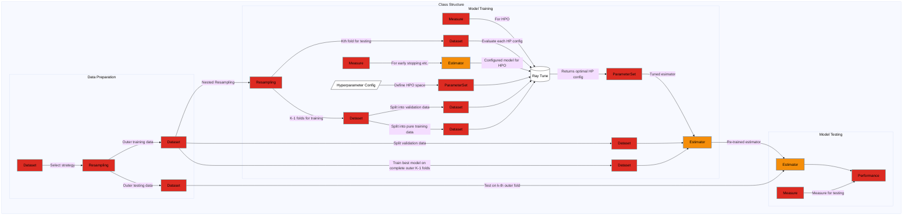

<p align="center">
  
  <h1 align="center">BenchSTPP</h1>
  <p align="center">
    <strong>A flexible, Hydra-powered benchmarking toolkit for streaming Spatio-Temporal Point Process models</strong>
  </p>

  <!-- Badges -->
  <p align="center">
    <a href="https://pypi.org/project/gluecode/"></a>
      <a href="https://github.com/YahyaAalaila/STPPGC/commits/main">
    
    <a href="https://img.shields.io/github/actions/workflow/status/YourOrg/GlueCode/ci.yml"></a>
     <a href="https://github.com/YahyaAalaila/STPPGC/issues">
    
  </a>
    <a href="https://img.shields.io/badge/license-Apache%202.0-blue.svg"></a>
  </p>
</p>

---
<p align="center">
  <!-- Python version -->
  <a href="https://www.python.org/doc/versions/">
    
  </a>
  <!-- PyTorch -->
  <a href="https://pytorch.org/">
    
  </a>
  <!-- PyTorch Lightning -->
  <a href="https://www.pytorchlightning.ai/">
    
  </a>
  <!-- Ray Tune -->
  <a href="https://docs.ray.io/en/latest/tune/index.html">
    
  </a>
</p>

## 📖 Overview

**BenchSTPP** is an easy-to-use, highly-configurable framework for

- 🔄 **Benchmarking** streaming Spatio-Temporal Point Process (STPP) models in parallel  
- ⚙️ **Config management** via  [![Hydra][hydra-badge]][hydra]  
- 📊 **Logging & tracking** via [![MLflow][mlflow-badge]][mlflow]  
- 🚀 **Distributed tuning** via [![Ray Tune][raytune-badge]][raytune]

...

[hydra]:     https://hydra.cc/  
[mlflow]:    https://mlflow.org/  
[raytune]:   https://docs.ray.io/en/latest/tune/index.html  

[hydra-badge]:   https://img.shields.io/badge/Hydra-1.3-blue?logo=hydra&logoColor=white  
[mlflow-badge]:  https://img.shields.io/badge/MLflow-1.38-orange?logo=mlflow&logoColor=white  
[raytune-badge]: https://img.shields.io/badge/Ray_Tune-2.9-yellow?logo=ray&logoColor=white  


Designed for researchers and practitioners who want:  
> “**One config → many runs**, fully reproducible, effortlessly parallel.”  

---

## 🔗 Table of Contents

| [News](#news) | [Features](#features) | [Installation](#installation) | [Quick Start](#quick-start) | [Usage](#usage) | [Configuration](#configuration) | [Benchmark](#benchmark) | [Contributing](#contributing) | [License](#license) |

---

## 🗞️ News

- 🆕 **2025-05-18** Added true parallel benchmarking with `ProcessPoolExecutor` and improved error handling.  
- 🆕 **2025-05-10** Fixed MLflow URI parsing bug (`file:./mlruns` now works!).  
- 🆕 **2025-04-30** Switched default config schema to Hydra v1.3.  

*(Click the “+” below to see past releases…)*

<details>
<summary>Previous news</summary>

- **2025-03-12** Initial public release: Hydra + MLflow + Optuna + multi-process runner  
- **2025-02-25** Added `RunnerState` checkpointing & resume  
</details>

---

## 🚀 Features

- **Modular Configurations**  
  Abstract `BenchmarkConfig` → one or more `RunnerConfig` → `DataConfig` / `ModelConfig` / `TrainerConfig` / `LoggingConfig` / `HPOConfig`  
- **Parallel Benchmarking**  
  Built–in support for `concurrent.futures.ProcessPoolExecutor`  
- **Seamless Logging**  
  Out-of-the-box MLflow integration with custom experiment & run naming  
- **Hyper-parameter Tuning**  
  Fully pluggable Optuna pipeline  
- **Framework-agnostic**  
  Run your favorite STPP in PyTorch → just subclass `BaseSTPPModule`  
- **Reproducible**  
  Deterministic seeds, config versioning, checkpoint & resume

---

## 💾 Installation

```bash
# From PyPI
pip install gluecode

# Or from source
git clone https://github.com/YourOrg/GlueCode.git
cd GlueCode
pip install -e .
```


## 🚀 Getting Started

Kick the tires with our **Example Usage** Colab:

<p align="left">
  <a href="https://colab.research.google.com/github/your-user/your-repo/blob/main/notebooks/example_usage.ipynb">
    
  </a>
</p>

Or clone locally and run:

```bash
git clone https://github.com/your-user/your-repo.git
cd your-repo
pip install -e .
python train.py --config-name example_usage
```

## Framework


